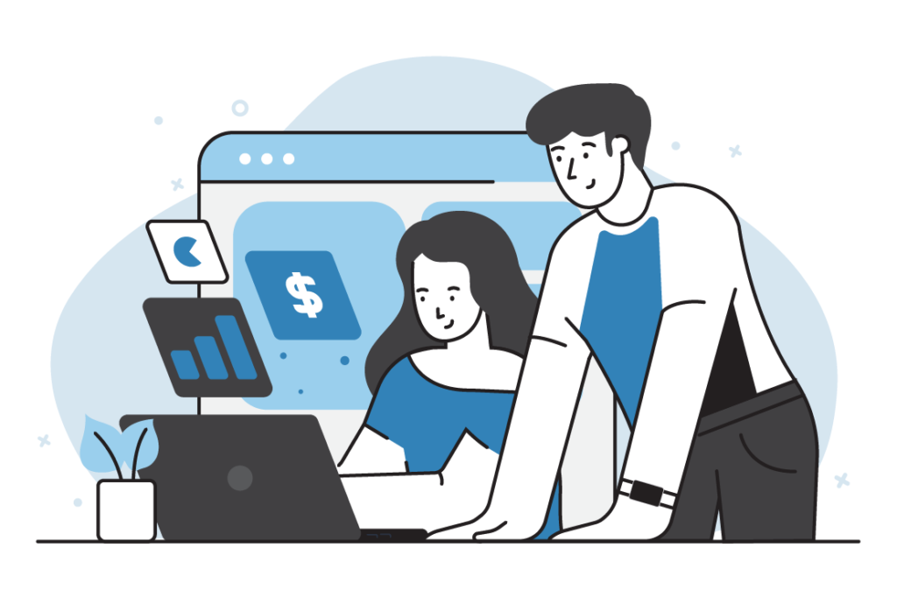
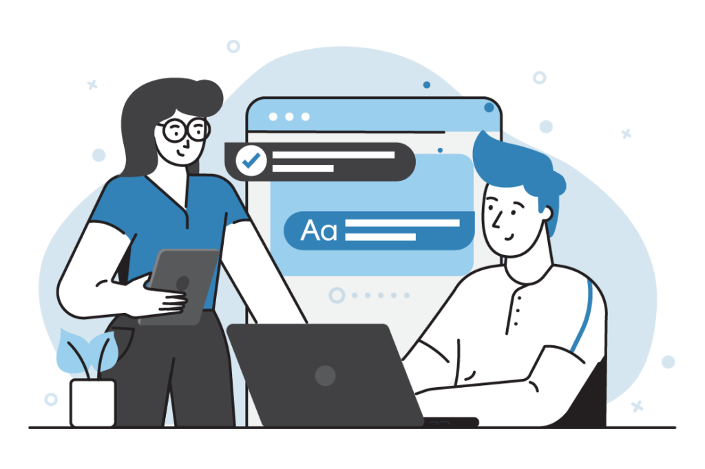

# Discover how our Shopify experts can help you boost sales, enhance user experience, and streamline operations.

In the competitive world of e-commerce, having a Shopify store is just the beginning. To truly stand out and achieve long-term success, you need a store that not only looks great but also performs exceptionally well.

That’s where [**Shugert’s Shopify Expert Services**](/shopify-experts "The best Shopify Experts") come in. Our team of seasoned professionals is dedicated to helping you optimize every aspect of your Shopify store, from design and development to marketing and management. In this blog post, we’ll explore how our expert services can transform your online business.

# Why You Need Shopify Expert Services

**_The Importance of Professional Shopify Services for E-commerce Success_**

Running a successful Shopify store involves more than just setting up products and hoping for the best. Here are some reasons why you need professional Shopify services:

- **Custom Design and Development:** Stand out from the competition with a unique and visually appealing store design by experienced Shopify developers.
- **Performance Optimization:** Improve site speed and performance to enhance user experience and increase conversions.
- **Marketing and SEO:** Implement effective marketing strategies and SEO practices with the help of Shopify SEO experts to drive more traffic to your store.
- **Ongoing Support:** Benefit from continuous support and maintenance to keep your store running smoothly.

By leveraging professional Shopify services, you can address these critical areas and set your store up for success.

# Introducing Shugert’s Shopify Expert Services

**_What Sets Shugert Apart from Other Shopify Experts?_**

At Shugert, we pride ourselves on delivering top-notch Shopify services tailored to your specific needs. Here’s what sets us apart:

- **Experienced Team:** Our team consists of certified Shopify experts with years of experience in e-commerce.
- **Comprehensive Services:** We offer a full range of services, including custom design, development, SEO, and marketing.
- **Client-Centric Approach:** We work closely with you to understand your business goals and create a strategy that aligns with them.
- **Proven Track Record:** Our portfolio includes numerous successful projects, showcasing our ability to deliver results.

# Benefits of Working with Shugert

**_Transform Your Shopify Store with These Key Benefits_**

1. Custom Store Design: Our Shopify developers create stunning, responsive designs that reflect your brand and engage your customers.
2. Enhanced User Experience: We optimize your store’s layout and navigation to ensure a seamless shopping experience.
3. Improved Site Performance: Our developers implement best practices to boost site speed and reliability.
4. Effective SEO and Marketing: Our Shopify SEO experts drive targeted traffic to your 4.store through advanced SEO techniques and marketing campaigns.
5. Ongoing Support and Maintenance: We provide continuous support to keep your store updated and running smoothly.

# Case Studies and Success Stories

**_Real Results: How Shugert Helped These Shopify Stores Thrive_**

_Case Study 1: Fashionable Canes_

Fashionable Canes struggled with a generic store design and low conversion rates. Shugert revamped their site with a custom design and optimized their product pages. As a result, Fashionable Canes saw a 35% increase in sales within six months. "Shugert transformed our store and our business," says Stephen, Founder of Fashionable Inc.

_Case Study 2: Tens Units_

TensUnits needed to improve their site performance and SEO. Shugert’s team implemented technical SEO strategies and enhanced the site’s speed. This led to a 40% increase in organic traffic and a significant boost in sales. "The results speak for themselves," says Liz, CEO of Tens Units.

# Getting Started with Shugert as your Shopify Expert Agency

**How to Partner with Shugert for Your Shopify Success**

Ready to take your Shopify store to the next level? Here’s how to get started with Shugert:

1. **Contact Us:** Reach out to us through our website or give us a call to discuss your needs.
2. **Consultation:** We’ll schedule a consultation to understand your business goals and challenges.
3. **Customized Plan:** Based on our discussion, we’ll create a tailored plan to optimize your Shopify store.
4. **Implementation:** Our team will get to work, executing the plan and making your vision a reality.
5. **Ongoing Support:** We’ll provide continuous support and maintenance to ensure your store remains at its best.

Getting Started with Shopify Experts

# Frequently Asked Questions

FAQs: Everything You Need to Know About Shugert’s Shopify Expert Services

**Q: What types of businesses do you work with?**

A: We work with businesses of all sizes across various industries, from startups to established brands.

**Q: How long does it take to see results?**

A: The timeline for results can vary based on the scope of work. However, our clients typically see significant improvements within the first few months.

**Q: What if I already have a Shopify store? Can you help improve it?**

A: Absolutely! We can audit your existing store and implement improvements to enhance its performance and user experience.

**Q: How much do your services cost?**

A: Our pricing is tailored to the specific needs of each client. Contact us for a personalized quote.

# Ready to Elevate Your E-commerce Success with Shugert?

Your Shopify store deserves the best, and Shugert’s Shopify Expert Services are here to provide it. From custom design and development to effective marketing and ongoing support, we have the expertise to transform your online business. Don’t settle for mediocrity—hire Shopify experts at Shugert today and unlock the full potential of your Shopify store.

**Contact Shugert now for a free consultation!**

[**Mail**](/contact "Contact Us") us or [**book a meeting**](https://calendly.com/snoriega/discovery-call "Join us in a meeting") to start your journey toward e-commerce success.

Visit our Shopify Expert profiles:

